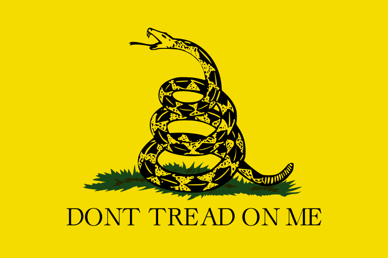

+++
title = "Why I am a Socialist"
slug = "why-i-am-a-socialist" # Set manually if title is not usable as slug
date = "2025-06-18T16:14:00-0600"
dateFormat = "2006-01-02 3:04:06 PM MST"
author = "KatieTheDev" # Set author name here!
#tags = ["", ""]
#keywords = ["", ""]
#description = ""
showFullContent = false
readingTime = true
hideComments = false
draft = false
+++
We must stand in solidarity together in order to create a cohesive plan for change. The billionaire class must no longer trample on the worker.

One thing that lead me to leftism, ironically, is libertarianism. I was briefly a libertarian as an edgy teenager. As we should all know, the Gadsden flag has the text "Don't tread on me". This idea of being independent from all masters perseveres into the ideas of communism. As a communist, I believe that the only way we as workers can be free of the capitalists' boots is to rid ourselves of capitalism. 

 
 

Capitalism is a system that is *designed* to give excess wealth and power to those who already have it, while draining it from those who do not. As we've seen in the great wealth transfers that have occurred in the age of Neoliberalism, kickstarted by Reagan and Thatcher, the wealthy will exploit any ounce of power they're given in order to get more. Silicon valley is a prime example: various tech CEOs such as Zuckerberg, Tim Cook, Steve Jobs, Bill Gates, Jeff Bezos, and more, their money was not born of their own work. Bezos was given money from his wealthy parents to start Amazon. Jobs was too, for Apple. Zuckerberg was also from a wealthy background, and Facebook originally existed as a site to rate how "hot" his classmates were.

After having the luck and investment to make their products grow, the Silicon Valley tech giants have gained so much power and wealth that they essentially own the government. Antitrust regulations have repeatedly faltered. Right to repair is currently struggling as a movement. We do not own what we paid for anymore. Without the ownership of our personal property, we essentially become beholden to the CEO and owner class even further. Oh, you're a dissident? Guess what, your toaster is bricked. Or, for a more real recent example, *Nintendo has bricked Switch consoles over power supply issues*. This is *not normal*. This is something we need to fight. And this is something that will *always exist under capitalism*. The erosion of ownership is inherit to the system. Why? Fuck you, that's why. The owning class demands it.

To see even further into the dystopia, we must take a look at the stock market, private equity, and retirement savings. Since the advent of the 401(k) and the death of the Pension in the US, we've seen an increase of power in the wealthy (aside from tech giants) such as Blackrock and other private equity and hedge fund management companies. Their playbook tends to follow (but isn't exactly) a few steps. First, the leveraged buyout. Form a shell company, fund it with some starting capital, and take out a loan to buy a company. This happened with Red Lobster. A private equity company bought them out with a loan. *A loan that used Red Lobster as collateral*. Next, sell the property to yourself. The private equity company bought all Red Lobster locations and rented them back to Red Lobster. They also made Red Lobster sign a contract to pay a management fee, a fixed bill that must be paid before anything else. The sales made Red Lobster have a *great* quarter on paper, allowing them to be extended more credit. Then, as often happens, the private equity company took a large dividend based on the loan. Then Red Lobster filed for bankruptcy. 

Another fucked-up corrupt method used by the private equity company? They own *everything*. The big three, Blackrock, Vanguard, and State Street, are the top shareholders of most companies, *and each other*. For all intents and purposes, they're basically the same company. And you know where that money comes from to buy everything? Investors. Which investors? You, me, and your neighbor. Your 401(k) is managed by a company. If you don't self-direct your investing, it is likely in a "Retirement Date Fund". That gives control over your investment choices directly to the fund manager. Your fund manager will likely contract with one of the "Big Three" to invest, or a multitude of other PE (private equity) companies. When you hand over your money, likely directly from your paycheck every pay period, the fund manager takes a cut as a management fee. Then, it's passed along to a private equity company, who also takes a cut. Your retirement fund is directly funding the death of America. Why? Because that money you give to them to invest is used to create huge short-term gains by all means necessary. To make matters worse, these PE companies don't even outperform a simple S&P 500 index fund! Some even generate negative value for the shareholder because they're too aggressive.

You know what else you give up when you invest with an unknown-to-you fund manager? You give up your voting interests. The fund manager *votes on behalf of you*. You give up your right to vote for who runs the company *that your money invested in*. Tell me how that isn't corrupt? This ultimately means that a small group of managers on Wall Street ultimately decide the will of the average American, and use that to serve their own interests, such as personal gain. They set their fees, they take bigger "performance fees" (such as 25% of all profit above a target goal!) and decide how the company is run *with your money*.

Given the above, I hope you can understand why capitalism is not sustainable, hurts the average person, and actively uses us all to our own detriment and to benefit the wealthy.
